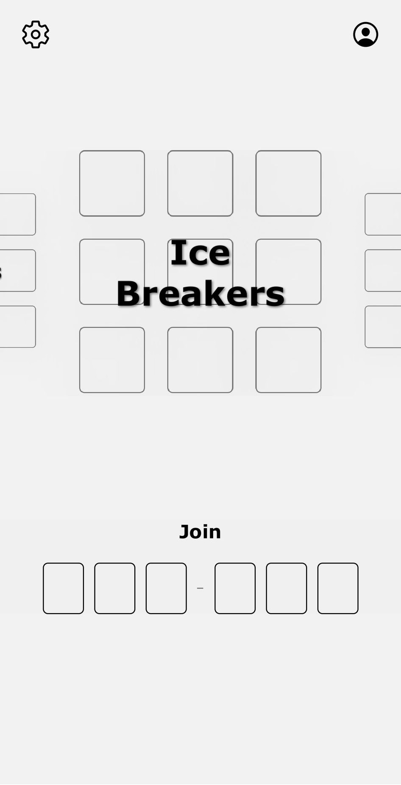
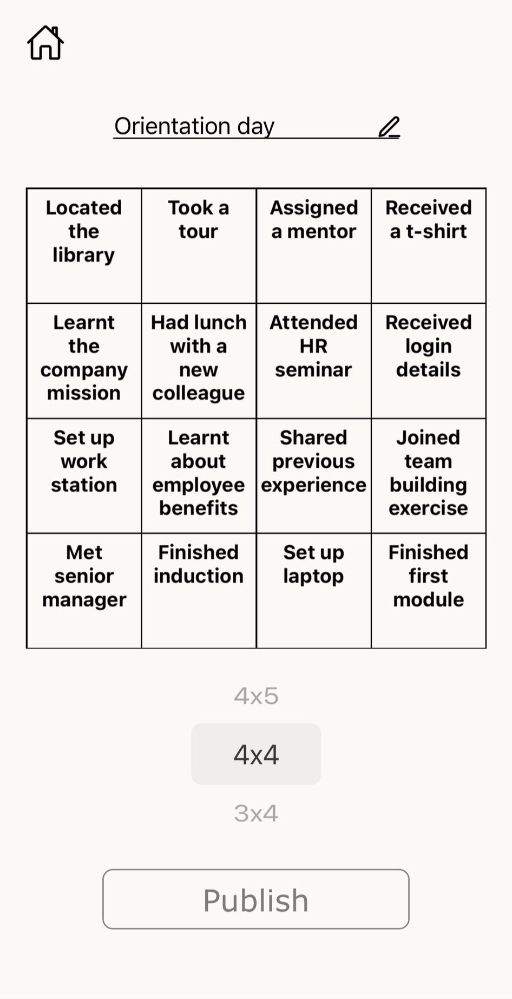
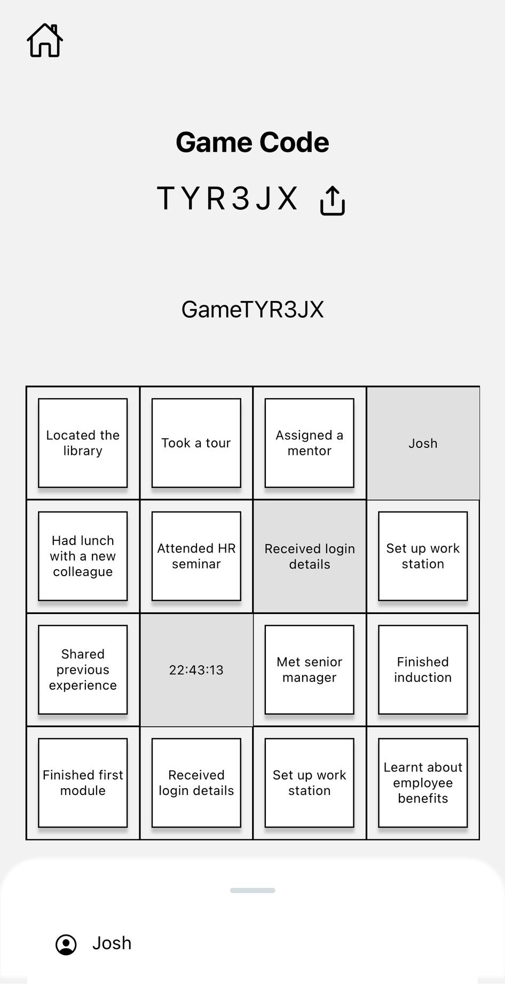

# Tacker Bingo

## Overview

This is the frontend repository for the Tacker Bingo application built using React Native and Expo. The app provides a mobile-friendly user interface for players to join and play custom-built bingo games for social events. The backend repo is built using Django, Postgres and Redis, providing real-time gameplay updates and offline queueing functionality.

### Home

Select a pre-built template from one of the categories or join an existing game

### Publish

Publish the pre-built template or customise it to make it your own

### Play

Complete squares and experience real-time updates from other players

## Technologies Used

- **React Native**
- **Typescript**
- **Expo**
- **Django**
- **Postgres**
- **Redis**

## Features

- Infinite carousel
- Intuitive UI and relevant pop up modals
- Real-time game updates via WebSockets
- Offline game functionality using expo-secure-storage and backend Redis queues

## Contributing

1. Fork the repo
2. Create a new branch (`feature-branch`)
3. Commit your changes
4. Push to your branch and create a pull request

## Contact

For any issues or feedback, open a GitHub issue or reach out to `joshkeisler.au@gmail.com`.
